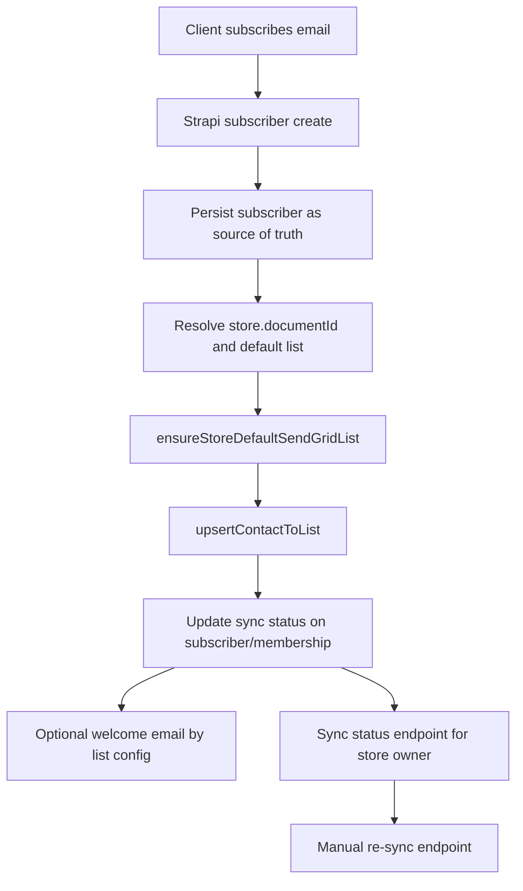

# Newsletter System Documentation

Complete email marketing system for Markketplace using SendGrid Marketing API + Extension System

## Architecture Overview

### Design Principles

1. **Strapi stores content** - Rich text editor, drafts, scheduling, versions
2. **SendGrid sends emails** - Deliverability, compliance, scale (millions of emails)
3. **Next.js serves archives** - Fast public URLs, SEO-friendly newsletter pages
4. **Extension system** - Privacy layer, logging, multi-provider flexibility

## Phase 1 TODO Flow (Pre-Implementation)

- Capture subscriber in `api::subscriber.subscriber` first (Strapi remains source of truth)
- Use `store.documentId` as canonical key for all sync resolution
- Resolve target `subscriber-list` entries and verify/create SendGrid lists
- Upsert contact to each target SendGrid list (multi-newsletter support)
- Update `subscriber-list-membership` status (`subscribed`, `failed`, sync timestamps)
- Trigger optional welcome email by list configuration
- Expose sync status endpoint for store owner visibility
- Expose manual re-sync endpoint for recovery and retries

## Phase 1 Progress (Implemented Chunks)

Current implementation is intentionally incremental to reduce risk.

### Chunk 1: Ensure one default list per store

Implemented in `src/services/sendgrid-marketing.ts`:

- `ensureStoreDefaultSendGridList(input)`
	- Resolves SendGrid API key from extension credentials (`use_default` or explicit `api_key`)
	- Reuses existing list by configured `existingListId` when available
	- Otherwise resolves by deterministic list name: `store:{storeDocumentId}:all`
	- Creates list when missing
	- Returns structured result with `success`, `created`, `listId`, `listName`

### Chunk 2: Upsert contact into list

Implemented in `src/services/sendgrid-marketing.ts`:

- `upsertContactToList(input)`
	- Validates required input (`listId`, `email`)
	- Sends `PUT /v3/marketing/contacts` with `list_ids` and contact profile
	- Returns async `jobId` and resolves `contactId` via email lookup
	- Includes TODO placeholders for future segmentation/tags/custom-fields mapping

## Minimal Testing (Current Scope)

These methods are service-level and can be tested before controller wiring.

1. Verify extension credentials via existing store extension test endpoint.
2. Call `ensureStoreDefaultSendGridList` with a valid `storeDocumentId`.
3. Re-run same call and verify idempotent behavior (reuses existing list).
4. Call `upsertContactToList` using returned `listId` and a test email.
5. Confirm SendGrid accepts request (`jobId` present) and contact appears in list.

## Deferred (Next Chunks)

- Wire subscriber controller/service to call these methods post-create
- Persist sync status updates on subscriber and list-membership entities
- Add manual re-sync endpoint for store owners
- Add unsubscribe mutation path (list-specific)

## Schema References (Current Phase)

Use these content types and attributes as the source of truth for phase-1 implementation.

- `api::subscriber.subscriber`
	- `Email`
	- `stores`
	- `lists`
	- `sendgrid_contact_id`
	- `sendgrid_list_ids`
	- `last_synced_at`
	- `sync_status`

- `api::subscriber.subscriber-list`
	- `store`
	- `name`
	- `slug`
	- `sendgrid_list_id`
	- `sendgrid_list_name`
	- `welcome_email`
	- `unsubscribe_settings`
	- `last_synced_at`
	- `sync_status`
	- `active`

- `api::subscriber.subscriber-list-membership`
	- `subscriber`
	- `list`
	- `status`
	- `subscribed_at`
	- `unsubscribed_at`
	- `unsubscribe_reason`
	- `sendgrid_contact_id`
	- `last_synced_at`

- `api::subscriber.newsletter`
	- `store`
	- `target_lists`
	- `subject`
	- `content`
	- `status`
	- `sendgrid_campaign_id`
	- `sendgrid_single_send_id`
	- `send_stats`

## Flow Diagram (Current + Next)

